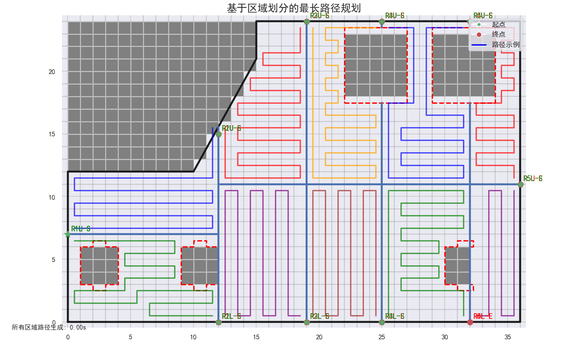

# 冷水管布线

## 1. 解决思路

三步：

1) **区域划分** - 将整体布局分割为子区域
2) **起终点选择** - 为每个子区域确定起点和终点
3) **路径生成** - 在每个子区域内创建一条路径

整体实现基于网格方法，满足布线间隔均匀的要求。

## 2. 项目代码结构

├── path_solver.py         # 求解器 json输入输出   
├── region_divider.py         # 区域划分器   
├── region_points_generator.py # 区域起终点生成器   
├── path_algorithm.py         # 核心路径查找算法   
└── region_path_generator.py  # 协调所有区域的路径生成   

## 3. 区域划分策略

区域划分过程遵循以下步骤：

1. **垂直划分**：首先按照等面积原则垂直划分布局，确保每个区域包含大约相同数量的有效网格单元。

2. **水平划分**：然后每个垂直区域再进行水平划分，同样目标是使上下子区域的覆盖面积相等。

这种方法避免了生成复杂边界，同时简化了划分过程。所有分隔线都位于整数坐标上以保持网格对齐，并且每个区域都保持与外部边界的连接。

*注：针对狭长型布局（列数>行数），布局设置时注意调整布局图的方向。且区域数为偶数*

## 4. 起点终点选择

系统通过识别以下交点来为每个子区域选择端点：
- 分隔线（垂直和水平）
- 外部边界

保证管道起点和终点在外边界。

## 5. 路径生成算法

系统采用两种主要算法：

1. **蛇形路径**（无障碍区域）：
   - 时间复杂度：O(n×m)，其中n和m是区域的行数和列数

2. **哈密顿路径**（有障碍区域）：
   - 使用带启发式的深度优先搜索
   - 通过曼哈顿距离启发式优化搜索方向
   - 动态调整策略：前70%搜索时远离终点，后30%搜索时接近终点
   - 理论最坏情况为O(4^(n×m))，但启发式大幅降低了实际运行时间
   - 实际复杂度通常接近O(n×m)，因为：
     * 启发式显著减少了搜索空间
     * 剪枝操作避免了无效路径
     * 对于大多数实际布局，有效分支因子远小于4

*注：区域形状为矩形，复杂边界通过设置障碍物来表示。*

## 6. 算法复杂度分析
- **外边界获取**：O(R×C)，其中R和C是布局的行数和列数
- **区域划分**：O(R×C)，其中R和C是布局的行数和列数
- **端点生成**：O(D)，其中D是分隔线的数量
- **路径生成**：
  - 蛇形路径：O(S)，其中S是子区域的网格数量
  - 哈密顿路径：实际复杂度通常接近O(S)，启发式显著优化了搜索效率
- **整体时间复杂度**：O(R×C + N×S)，其中N是子区域数量，S是每个子区域的平均网格数量

虽然哈密顿路径算法的理论最坏情况复杂度很高，但通过曼哈顿距离启发式和动态搜索策略，实际运行时间近似线性，使系统在实际应用中保持高效性能。

## 7. 运行结果

num_regions（需为偶数）的设置还比较重要，可以根据整体面积（即总体网格数）与水管长度限制做估算，默认为10。 
num_regions值可以稍大一些，减少单次哈密顿路径生成算法的复杂度。 
比如在如下图示例，取水管长度最长为200时，区域划分数最小为6。路径的覆盖效果并不理想，同时单次哈密顿路径生成耗时分别达到了: 111.42秒222.58秒。 
而num_regions=10是，单次哈密顿路径生成时间是0.00秒（秒级以下） 

